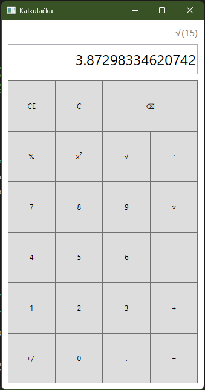

# Kalkulačka - WPF aplikace

Tato aplikace je vědecká kalkulačka vytvořená v technologii WPF v jazyce C#. Umožňuje provádět základní i pokročilé matematické operace.

## Funkce

- Základní operace: sčítání, odčítání, násobení, dělení
- Pokročilé funkce: druhá odmocnina, druhá mocnina, třetí mocnina, třetí odmocnina, faktoriál, logaritmus
- Přepínání znaménka (pozitivní/negativní čísla)
- Desetinná tečka
- Podpora vstupů z klávesnice i klikání na tlačítka
- Zobrazení předchozí operace
- Paměť pro ukládání výpočtů



## Technologie

- **C#**
- **WPF** (Windows Presentation Foundation)

## Instalace a spuštění

1. Klonujte repozitář:
   ```bash
   git clone https://github.com/DippyM/Kalkul

   Otevřete projekt v Visual Studio nebo Visual Studio Code.
    Spusťte aplikaci.
    Jak používat
    Klikáním na tlačítka: Používejte myš pro zadávání čísel a operátorů.
    Z klávesnice: Lze používat klávesy na numerické klávesnici i základní klávesnici pro zadávání čísel a operátorů.
    Klávesové zkratky:
    NumPad: 0-9, +, -, *, /
    Enter: Výpočet výsledku
    Backspace: Mazání poslední číslice
    Escape: Vymazání celé obrazovky
